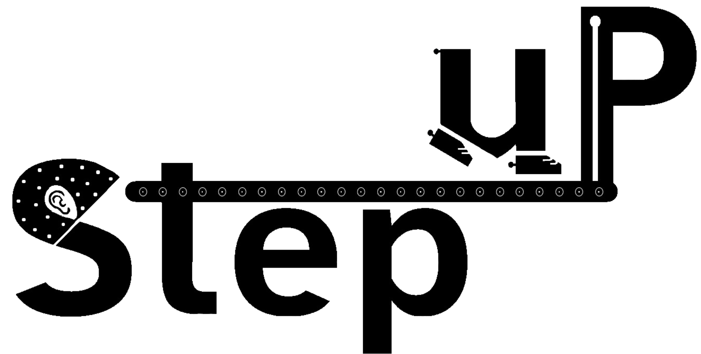

{width="80%" fig-align="center"}

# Welcome
Welcome to the StepuP Consortium Meeting in Bologna. Over two days we will share the StepuP experience and preliminary results, align on the analysis plan, and present ongoing scientific work. There will also be time for social activities and the first StepuP Olympics.

The meeting will be held on the **29th and 30th of June 2026** at the **Ospedale Bellaria** in Bologna.

## Online attendance
Participation will also be available online via *Zoom*.

- Monday (Day 1): StepuP meeting – Day 1 *(link to be shared)*
- Tuesday (Day 2): StepuP meeting – Day 2 *(link to be shared)*

## Timetable
The first day covers the StepuP experience, preliminary results and the analysis plan. The second day is dedicated to scientific presentations and the closing session. All times below are local time in Bologna (CEST).

### Day 1 (Monday, 29th June)

| Time (CEST)   | Topic                  |
|---------------|------------------------|
| 08:45 – 09:10 | Arrival                |
| 09:10 – 09:30 | Welcome                |

#### Part 1 - StepuP experience and preliminary results
*Chairs: Fabio and Moira (Yoshi and Deepak from 11:00)*

| Time (CEST)   | Topic                                            | Speaker            | Site               | Time (Tel Aviv) | Time (Sydney) | Slides |
|---------------|--------------------------------------------------|--------------------|--------------------|-----------------|---------------|--------|
| 09:30 – 10:00 | StepuP experience and preliminary results        | Lila, Julius       | Kiel               | 10:30           | 17:30         |        |
| 10:00 – 10:30 | StepuP experience and preliminary results        | Yoshi              | Sydney             | 11:00           | 18:00         |        |
| 10:30 – 11:00 | Coffee break                                     |                    |                    | 11:30           | 18:30         |        |
| 11:00 – 11:30 | StepuP experience and preliminary results        | Ilaria, Francesca, … | Bologna, Tel Aviv | 12:00           | 19:00         |        |
| 11:30 – 12:00 | StepuP experience and preliminary results        | Moira              | Amsterdam          | 12:30           | 19:30         |        |
| 12:00 – 12:30 | Discussion: lessons learned and preliminary results |                 |                    | 13:00           | 20:00         |        |
| 12:30 – 14:00 | Lunch                                            |                    |                    | 13:30           | 20:30         |        |

#### Part 2 - StepuP analysis plan
*Chairs: Jaap and Walter*

| Time (CEST)   | Topic                          | Time (Tel Aviv) | Time (Sydney)     | Slides |
|---------------|--------------------------------|-----------------|-------------------|--------|
| 14:00 – 14:40 | WP updates (10 min per WP) | 15:00 | 22:00         |        |
| 14:40 – 15:10 | Primary analyses (1 slide presentation for each analysis, outlining aims and methods) | 15:40 | 22:40 |        |
| 15:10 – 15:40 | Secondary analyses (1 slide presentation for each analysis, outlining aims and methods) | 16:10 | 23:10 |        |
| 15:40 – 16:30 | Discussion: analysis plan      | 16:40           | 23:40             |        |
| 16:30 – 18:00 | StepuP Olympics Game (optional) | 17:30          | 00:30 (next day)  |        |

### Day 2 (Tuesday, 30th June)

| Time (CEST)   | Topic     | Time (Tel Aviv) | Time (Sydney) |
|---------------|-----------|-----------------|---------------|
| 08:30 – 08:40 | Arrival   | 09:30           | 16:30         |

#### Part 1 - Scientific presentations
*Chairs: Jeff and Luca*

| Time (CEST)   | Topic                                                                                  | Speaker          | Time (Tel Aviv) | Time (Sydney) | Slides |
|---------------|----------------------------------------------------------------------------------------|------------------|-----------------|---------------|--------|
| 08:40 – 09:00 | Advancing Deep Brain Stimulation management through digital technology                  | Ilaria           | 09:40           | 16:40         |        |
| 09:00 – 09:20 | Beta oscillations in Deep Brain Stimulation for Parkinson's disease                     | Bernadette      | 10:00           | 17:00         |        |
| 09:20 – 09:40 | Neurophysiology of Parkinson's Gait                                                     | Julius           | 10:20           | 17:20         |        |
| 09:40 – 10:00 | Discussion: Scientific Presentations (1)                                                |                  | 10:40           | 17:40         |        |
| 10:00 – 10:20 | Coffee break                                                                            |                  | 11:00           | 18:00         |        |

#### Part 2 - Scientific presentations
*Chairs: Ilaria and Julius*

| Time (CEST)   | Topic                                                                                  | Speaker          | Time (Tel Aviv) | Time (Sydney) | Slides |
|---------------|----------------------------------------------------------------------------------------|------------------|-----------------|---------------|--------|
| 10:20 – 10:40 | New perspectives on analysing real-world gait data *(requires further specification)*   | Charlotte        | 11:20           | 18:20         |        |
| 10:40 – 11:00 | Effects of VR obstacle training on gait in the lab and real-world – A Sydney sub study protocol | Yoshi    | 11:40           | 18:40         |        |
| 11:00 – 11:20 | Wearables for monitoring, assistance, and rehabilitation of Parkinson's disease         | Luca, Giovanna   | 12:00           | 19:00         |        |
| 11:20 – 11:40 | Discussion: Scientific Presentations (2)                                                |                  | 12:20           | 19:20         |        |
| 11:40 – 12:00 | Discussion *After StepuP* & closing session                                             |                  | 12:40           | 19:40         |        |
| 12:00 – 14:00 | Lunch (optional)                                                                        |                  | 13:00           | 20:00         |        |

All slides and materials will be made available online after the meeting.

## StepuP Olympics Game
On Monday afternoon (16:30 – 18:00, optional) we will hold the first StepuP Olympics with three challenges:

- **2-min walking challenge** – walk as far as you can in 2 minutes
- **EEG Setup Sprint** – prepare and set up the EEG in record time
- **VR treadmill experience** – treadmill session using virtual reality

Organizing committee: Ilaria and Leonardo

## Social activities

**Sunday 28th**

- Bologna tour @ city centre
- Dinner h. 18:30 @ *to be defined*

**Monday 29th**

- Dinner h. 19:30 @ *to be defined*

The dinners take place in the city center, about a 15-minute walk from the central railway station.

## Location
The meeting will be held at the **Institute of Neurological Science @ [Bellaria Hospital](https://www.google.com/maps/place/Padiglione+G/@44.46433,11.3893636,18z/data=!3m1!5s0x477e2ae33001c55f:0xb90208f6e9f89ae3!4m14!1m7!3m6!1s0x477e2afccb033127:0x6e8b845ae84ba877!2sOspedale+Bellaria!8m2!3d44.4632389!4d11.3904043!16s%2Fg%2F122_4mby!3m5!1s0x477e2b23b1f728e9:0xc07d6b455a0ca981!8m2!3d44.4647524!4d11.3900003!16s%2Fg%2F11r8xch1bv?entry=ttu&g_ep=EgoyMDI2MDYyMS4wIKXMDSoASAFQAw%3D%3D)**, Via Altura 3, Bologna.

- **Meeting Room:** “Montagna”, Building G (1st floor).

Public transport: Lines 36 (from the railway station area) and 90 have stops in front of the main entrance of the hospital.

## Social events

- **Welcome aperitif** @ Lab 16, h. 18:30 (Sunday) – [Via Zamboni 16/D](https://maps.app.goo.gl/53nbXKktTMLqpCNQA)
- **StepuP dinner** @ Ristorante Nino, h. 19:30 (Monday) – [Via Volturno 9c](https://maps.app.goo.gl/qVWXFuz5APhPqryj8)

## Presentations

- We have created a folder on Research Drive where you can upload your presentation:

  [Bologna_meeting_2026](https://vu.data.surf.nl/apps/files/files/261048580?dir=/FGB_BM_StepuP%20%28Projectfolder%29/meetings_and_conferences/bologna_meeting_2026)

- Alternatively, you can send it directly to me. This will help us ensure smooth transitions between presentations.
- The Monday afternoon session on data analysis will be divided into two parts.
- As indicated in the program, each session will be moderated by two chairs, who will facilitate the discussion.

## Transportation

### Airport – City centre
- **Marconi Express** – a fast monorail service that connects the airport to Bologna Central Train Station (Stazione Centrale) in just 7 minutes. Trains run every 7–15 minutes. Tickets can be purchased at the station.
- **Taxi** – taxis are available outside the arrivals terminal, taking approximately 20 minutes to reach the city centre.
- **Bus** – Aerobus shuttles (Line 949) operate regularly throughout the day, taking approximately 28 minutes to reach Piazza Malpighi (city centre). Tickets can be bought online, on the bus, or at the ticket machines at the airport.

### Railway station – City centre
Bologna Centrale is one of Italy's main train hubs, connecting the city to major Italian cities like Milan, Florence, Rome and Venice via high-speed trains (Frecciarossa, Italo). The station is located close to the city center, just a 15-minute walk or a short bus/taxi ride away.

## Accomodation
We recommend booking accommodation close to the **central railway station**, which is well connected to both the airport and Bellaria Hospital. The hospital is on the opposite side of the city from the airport and is approximately 50 minutes by bus from the central station. The dinners take place in the city center, about a 15-minute walk from the station.

## Organizers

The meeting is hosted by the Bologna team at the IRCCS Istituto delle Scienze Neurologiche di Bologna. For questions, please contact [Julius](mailto:j.welzel@neurologie.uni-kiel.de?subject=StepuP%20meeting%20Bologna).
